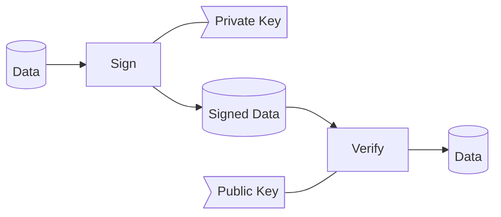

# What are signatures?

## Introduction

Signatures are another means of security ROBLOX uses to prevent any unauthorized tampering with external requests from ROBLOX Servers.

Traditionally, signatures are, as the name suggests, a method to determine the actual author/sender of an article.

In today's world, digital signatures are analogous (to traditional signatures) — They utilize mathematical algorithms to validate the authenticity of data.[^1]

This graph demonstrates the signing process conceptionally:[^2]

## Client Signatures

ROBLOX uses (and *used*) signatures for a multitude of things including but not limited to:
    
- [JoinScripts](/Client Security/JoinScripts)
- Online CoreScripts (2010-2014)[Citation needed]

### Specification
ROBLOX uses the [RSA](https://en.wikipedia.org/wiki/RSA_(cryptosystem)) algorithm (1024-bits) with X509 and PKCS7 encoding.

Signature wrappers have differed between the years but here are the primary forms:

- `%DATA%` (2010-2013)
- `--rbxsig%DATA%` (2013-2020)
- `--rbxsig2%DATA%` (Since 2018)
- `--rbxsig4%DATA%` (Since 2020)

(**DATA** refers to the actual signature)

<h3 id="see-also">See Also:</h3>
- [Generating a public/private key](/Extras/KeyGeneration)
- [JoinScripts](/Client Security/JoinScripts)

[^1]: More Information: [https://www.cisa.gov/uscert/ncas/tips/ST04-018](https://www.cisa.gov/uscert/ncas/tips/ST04-018)
[^2]: Signed Data goes from server to client; Client verifies.